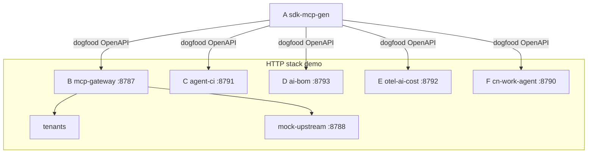

# OSS Cash Lab · Monetizable OSS bet portfolio

> Portfolio of six monetizable OSS bets (Agent / MCP / observability).

**Owner:** wozqhl · **License:** Apache-2.0 · **Status:** local-mvp · **Version:** [0.1.0](./VERSION) ([CHANGELOG](./CHANGELOG.md))

## Why a portfolio?

1. Fast willingness-to-pay checks (B/C first)
2. OSS for distribution; enterprise features for revenue
3. Shared building blocks (policy, audit, eval, cost)

See [docs/thesis.md](./docs/thesis.md), [ROADMAP.md](./ROADMAP.md), and [docs/pilot-contract-outline.md](./docs/pilot-contract-outline.md) (DRAFT).

## Bets

| ID | Dir | Lang | One-liner | Phase |
|----|-----|------|-----------|-------|
| A | bets/a-sdk-mcp-gen | TS (+Py/Go/Java/Rust/C#/Kt/Swift/Ruby/PHP) | OpenAPI 3.0/3.1 (JSON/YAML) to multi-lang SDK (timeout/429-retry/per-op auth) + stdio MCP servers (Node + Python) + generate Action | 2 |
| B | bets/b-mcp-gateway | TS | Enterprise MCP gateway + serve `--watch` + HTML audit | **1** |
| C | bets/c-agent-ci | Py | Deterministic agent CI + queue + CORS + rate-limit + X-Request-Id + OpenAPI + Prometheus `/metrics` + serve `--watch` + HTML run report | **1** |
| D | bets/d-ai-bom | Py | AI-BOM + policy/evidence + SPDX + CycloneDX 1.7/SPDX 2.3 export + CRA license gate + `.aibomignore` + local BOM HTTP serve + CORS + rate-limit + X-Request-Id + OpenAPI + `/ready` + Prometheus `/metrics` + `--watch` + `GET /v1/config` | 2 |
| E | bets/e-otel-ai-cost | TS | AI cost plane + redact/route packs + local report server + finance CSV + Markdown cost report + tenant budget + optional UTC-day period + `GET /v1/config` + `GET /v1/spans` + `GET /v1/tenants` + `GET /v1/tenants.csv` + CORS + rate-limit + X-Request-Id + OpenAPI + `/ready` + Prometheus `/metrics` | 3 |
| F | bets/f-cn-work-agent | Py | Multi-IM webhook agent + approvals + native IM cards + `GET /v1/platforms` + `GET /v1/config` + audit CSV + Markdown + HTML list + TTL + rate-limit + CORS + X-Request-Id + OpenAPI + `/ready` + Prometheus `/metrics` + decision webhook + Dify/n8n sample forward + serve `--watch` | 3 |

## Architecture

A generates SDKs from each bet OpenAPI (B/C/D/E/F dogfood). B is the gateway (tenants + mock-upstream proxy). C/D/E/F are HTTP services on the local stack.

A 从各服务 OpenAPI 生成 SDK（B/C/D/E/F dogfood）；B 网关承载 tenants 并代理 mock-upstream；C agent-ci、D ai-bom、E otel cost、F cn-work-agent 各自提供 HTTP。栈端口：B **8787**、C **8791**、D **8793**、E **8792**、F **8790**、mock-upstream **8788**（详见 [docs/stack-demo.md](./docs/stack-demo.md)）。



## 90-day priority

- Week 1-2: B + C MVP parallel
- Week 3-6: paid pilot for B/C; start A + D
- Week 7-12: E cost demo + F one IM connector

## Quick start

```bash
make list
make version       # portfolio 0.1.0 from ./VERSION (source of truth)
make smoke
make local-mvp
make wire-a-to-b   # A generate petstore -> B /tools/list proof
make dogfood-a-b   # A generate clients from B OpenAPI (TS/Py/Go)
make dogfood-a-c   # A generate clients from C OpenAPI (TS/Py/Go)
make dogfood-a-d   # A generate clients from D OpenAPI (TS/Py/Go)
make dogfood-a-e   # A generate clients from E OpenAPI (TS/Py/Go)
make dogfood-a-f   # A generate clients from F OpenAPI (TS/Py/Go)
make stack-demo    # B+C+D+E+F HTTP stack without Docker (see docs/stack-demo.md)
make check-k8s     # parse-only deploy/k8s (also hooked from make smoke; no cluster)
make check-helm    # parse-only deploy/helm (also hooked from make smoke; helm template if helm on PATH; skip like docker)
make check-dockerfiles # parse-only B-F Dockerfiles (EXPOSE/CMD/HEALTHCHECK → /health; skip docker build if no docker)
make check-gha-examples # parse-only examples/github-actions (A OpenAPI drift + C JUnit + run-vs-run diff + D SARIF + E GHA annotations; also hooked from smoke)
make check-grafana # parse-only deploy/grafana JSON (also hooked from smoke; no Grafana process)
make check-prom-rules # parse-only Prometheus rules + PrometheusRule YAML (also hooked from smoke; no Prometheus)
make check-oss-hygiene # NOTICE + .editorconfig + SECURITY.md + CODE_OF_CONDUCT.md (also hooked from smoke; no restyle)
make check-mcp-examples # parse-only examples/mcp B HTTP client snippet (also hooked from smoke; no Cursor)
make security-scan # D ai-bom per bet + secret pattern grep (kept separate from local-mvp)
```

> **Versioning:** root [`VERSION`](./VERSION) is the portfolio source of truth (`make version`). Bet `package.json` / `pyproject.toml` / CLI `--version` constants are aligned to **0.1.0** for this release; they may optionally read `VERSION` later. See [CHANGELOG.md](./CHANGELOG.md).

### Integration notes

- **Stack demo**: `make stack-demo` / `docker compose up` — see [docs/stack-demo.md](./docs/stack-demo.md).
- **Kubernetes (manifests only)**: [`deploy/k8s/`](./deploy/k8s/) Deployment+Service for B/C/D/E/F (`ghcr.io/wozqhl/<bet>:dev` placeholders — **images are not published**). Liveness `GET /health`, readiness `GET /ready` (503 on drain / B circuit / C queue), `terminationGracePeriodSeconds: 10` (~5s SIGTERM drain + buffer). ClusterIP 80 (`port` name `http`) to bet ports B **8787** / C **8791** / D **8793** / E **8792** / F **8790**. Optional Prometheus Operator [`servicemonitor.yaml`](./deploy/k8s/servicemonitor.yaml) scrapes `GET /metrics` (`port: http`, 30s; needs `monitoring.coreos.com/v1` CRDs — not applied in smoke). Importable Grafana 9/10 dashboard: [`deploy/grafana/oss-cash-lab.json`](./deploy/grafana/oss-cash-lab.json) (five rows B/C/D/E/F; Grafana → Dashboards → Import; Prometheus uid `prometheus` or `${DS_PROMETHEUS}` — **no live Grafana**). Prometheus alerting rules: [`deploy/prometheus/rules.yaml`](./deploy/prometheus/rules.yaml) (`prometheus --rule.file` / Mimir) and [`deploy/k8s/prometheusrule.yaml`](./deploy/k8s/prometheusrule.yaml) (same groups as a PrometheusRule CRD; apply after CRDs; not in kustomize). Parse-only via `scripts/check-k8s.sh` + `scripts/check-grafana.sh` + `scripts/check-prometheus-rules.sh` (hooked from `make smoke`; PyYAML or stdlib subset / `json.loads`). Dockerfiles at `bets/<bet>/Dockerfile` (Compose `build:` context; `node:20-alpine` B/E, `python:3.12-alpine` C/D/F; EXPOSE those ports; CMD `serve --host 0.0.0.0`; image HEALTHCHECK → `/health`). `make check-dockerfiles` / smoke parse FROM/EXPOSE/CMD/HEALTHCHECK; **skip `docker build` if Docker is missing**. Example: `docker build -t ghcr.io/wozqhl/b-mcp-gateway:dev bets/b-mcp-gateway`. NetworkPolicy: [`deploy/k8s/networkpolicy.yaml`](./deploy/k8s/networkpolicy.yaml) (one per B–F bet; Ingress+Egress; same-namespace + Prometheus scrape + kube-system; egress DNS 53 + HTTPS 443; **in kustomize**; CNI must support NetworkPolicy — kubelet probes are node-network). PodDisruptionBudget: [`deploy/k8s/pdb.yaml`](./deploy/k8s/pdb.yaml) (one per B–F bet; `policy/v1`; **`maxUnavailable: 1`** so replica=1 can still drain — `minAvailable: 1` with 1 replica **blocks** node drain; HA needs replicas ≥2 + `minAvailable: 1`; **in kustomize**). HorizontalPodAutoscaler: [`deploy/k8s/hpa.yaml`](./deploy/k8s/hpa.yaml) (one per B–F bet; `autoscaling/v2`; CPU 70%, `minReplicas: 1` / `maxReplicas: 4`; **in kustomize**; **needs metrics-server** to scale — idle without it; does not change `replicas: 1`). Ingress: [`deploy/k8s/ingress.yaml`](./deploy/k8s/ingress.yaml) (one Ingress; five host rules Prefix `/` — `gateway`/`ci`/`bom`/`cost`/`agent`.oss-cash-lab.local; class `nginx`; **in kustomize**; **needs an ingress controller** — idle without it; TLS omitted; `/etc/hosts`). LimitRange: [`deploy/k8s/limitrange.yaml`](./deploy/k8s/limitrange.yaml) (one `LimitRange`; `v1`; type `Container`; defaultRequest 50m/64Mi + default 500m/256Mi when resources omitted; **in kustomize**; does **not** change Deployments that already set resources). ResourceQuota: [`deploy/k8s/resourcequota.yaml`](./deploy/k8s/resourcequota.yaml) (one `ResourceQuota`; `v1`; hard caps for B–F × HPA maxReplicas 4 plus headroom — pods 24 / requests 2 CPU 2Gi / limits 12 CPU 6Gi / services 10; **in kustomize**; pairs with LimitRange). securityContext: baked into each B–F Deployment (pod `runAsNonRoot` + numeric `runAsUser` 1000 B/E / 65532 C/D/F; container drop ALL, no privilege escalation, read-only root + `emptyDir` `/tmp`; B/C/F also `/app/data`). Optional Helm: [`deploy/helm/oss-cash-lab/`](./deploy/helm/) (same images/ports; NetworkPolicy off by default; PDB off by default via `pdb.enabled`; HPA off by default via `hpa.enabled`; Ingress off by default via `ingress.enabled`; LimitRange **on** by default via `limitRange.enabled`; ResourceQuota **off** by default via `resourceQuota.enabled` so a shared-ns install does not fight existing quotas; securityContext **on** by default via `securityContext.enabled`; no ServiceMonitor/PrometheusRule CRDs; **kustomize stays the default apply path**; `make check-helm` / smoke parse, skip `helm template` if helm missing). `make local-mvp` / `make stack-demo` do not start k8s, Grafana, Prometheus, Helm, or containers. See [deploy/k8s/README.md](./deploy/k8s/README.md), [deploy/helm/README.md](./deploy/helm/README.md), [deploy/grafana/README.md](./deploy/grafana/README.md), and [deploy/prometheus/README.md](./deploy/prometheus/README.md).
- **GitHub Actions examples (A OpenAPI drift + C JUnit + run-vs-run diff + D SARIF + E GHA annotations)**: copy-paste workflows in [`examples/github-actions/`](./examples/github-actions/) (`sdk-mcp-gen-check.yml` / `agent-ci-junit.yml` / `ai-bom-sarif.yml` / `otel-ai-cost-gha.yml` + thin composites). Not required on this repo (keep [`.github/workflows/ci.yml`](./.github/workflows/ci.yml) as the gate). A: `node src/cli.js generate examples/petstore.openapi.json --out sdk` then `generate … --out sdk-new --check-baseline sdk` (exit 1 if tools removed/renamed; or `check --out NEW --baseline sdk`; omit `--out` → temp dir). C: `python3 -m agent_ci run --suite fixtures/demo --junit junit.xml` then `actions/upload-artifact@v4`. Optional log annotations: `run --format gha`. Optional run-vs-run Markdown: `diff --from run-a.json --to run-b.json --format md >> "$GITHUB_STEP_SUMMARY"` (identical demo dumps → “no changes”; previous artifact as `--from`). D: `python3 -m ai_bom scan examples/sample-app --policy policies/default.json --sarif ai-bom.sarif` then `github/codeql-action/upload-sarif@v3` (consumer must enable code scanning; do not enable it here). Optional log annotations: `scan --format gha`. Optional: HTTP `GET /v1/bom?format=sarif` on `serve` (same SARIF; stack-demo without CLI file). E: `node src/cli.js report --in examples/spans.json --format gha` (empty / exit 0 with no `--budget`; tight `--budget` → `::error title=budget::` + exit 1; `--tenant-budget acme=0.0001` → `::error title=tenant/acme::`). Optional Markdown `$GITHUB_STEP_SUMMARY` + `upload-artifact` `costs.md`. `make check-gha-examples` / smoke parse + demo-fixture CLI.
- **MCP client config (B HTTP, not stdio):** paste-ready [`examples/mcp/gateway.mcp.json`](./examples/mcp/gateway.mcp.json) (`mcpServers` + `url` `http://127.0.0.1:8787/mcp` + Bearer placeholder). Cursor/Claude remote MCP uses **`url`**, not A generated `command`. B `/mcp` is POST JSON-RPC + DELETE session (`GET` 405 Allow: POST, DELETE; no SSE). Set the token from policy tenant `apiKey` (example acme). `make check-mcp-examples` / smoke JSON.parse. Does not start Cursor.
- **A→B**: `scripts/wire-a-to-b.sh` generates MCP tools from OpenAPI and loads them into B policy (file-based).
- **Dogfood A→B**: `make dogfood-a-b` / `scripts/generate-gateway-sdk.sh` runs A against B's `openapi/gateway.openapi.json` → `bets/b-mcp-gateway/sdk/generated/` (gitignored; also hooked from `make local-mvp`).
- **Dogfood A→C**: `make dogfood-a-c` / `scripts/generate-runner-sdk.sh` runs A against C's `openapi/runner.openapi.json` → `bets/c-agent-ci/sdk/generated/` (gitignored; also hooked from `make local-mvp`).
- **Dogfood A→D**: `make dogfood-a-d` / `scripts/generate-bom-sdk.sh` runs A against D's `openapi/bom.openapi.json` → `bets/d-ai-bom/sdk/generated/` (gitignored; also hooked from `make local-mvp`).
- **Dogfood A→E**: `make dogfood-a-e` / `scripts/generate-cost-sdk.sh` runs A against E's `openapi/cost.openapi.json` → `bets/e-otel-ai-cost/sdk/generated/` (gitignored; also hooked from `make local-mvp`).
- **Dogfood A→F**: `make dogfood-a-f` / `scripts/generate-agent-sdk.sh` runs A against F's `openapi/agent.openapi.json` → `bets/f-cn-work-agent/sdk/generated/` (gitignored; also hooked from `make local-mvp`).
- **A breaking check**: `node bets/a-sdk-mcp-gen/src/cli.js check --out DIR --baseline DIR` (MCP tool names + optional TS/Python/Go/Java/Rust/C#/Kotlin/Swift/Ruby/PHP client exports; removed/renamed → exit 1). Convenience: `generate … --check-baseline DIR`.
- **A watch regenerate**: `generate … --out DIR --watch` polls OpenAPI **file** mtime every 200ms and reprints `regenerated` on change. **`--watch --url`** polls the remote spec every **2s** (override `--watch-interval-ms`): `If-None-Match` / **304** skip, else SHA-256 body hash. `--header` applies to polls (secrets not logged). Fetch errors log once and keep the previous generation. local-mvp proves file watch + isolated `http.server` URL watch (mutate → regenerated → kill). `--check-baseline` remains one-shot without watch.
- **A checksums**: `generate` writes `checksums.sha256` (sha256 of existing client.ts + package.json + client.py/go + Client.java + client.rs + Client.cs + Client.kt + Client.swift + client.rb + Client.php + mcp-tools.json + mcp-server.mjs + mcp_server.py + mcp_server.go + mcp.json + README.md + LICENSE + NOTICE + .gitignore); `verify-checksums --out DIR` exits 0 on match, 1 on missing/mismatch (local-mvp tweak/restore). `--zip` archives are written after the manifest and are not listed. `--no-license` omits LICENSE/NOTICE from the manifest. `--no-gitignore` omits `.gitignore`.
- **A generate --dry-run**: `generate … --out DIR --dry-run` prints `{files, operations, tools, langs, packageName}` JSON (includes `mcp-server.mjs` + `mcp_server.py` + `mcp_server.go` + `mcp.json` + TS `package.json` + `LICENSE` + `NOTICE` + `.gitignore`) and writes nothing (local-mvp proves empty/unchanged; default langs list includes `client.ts` and the other default clients). `--no-mcp` omits the servers and `mcp.json`. `--no-license` omits `LICENSE` and `NOTICE`. `--no-gitignore` omits `.gitignore`. `--zip` adds `sdk.tgz` or `sdk.zip` to `files`.
- **A generate --zip**: emit sdk.tgz (tar on PATH) or sdk.zip (Node stdlib fallback) after checksums. Checksums omit the archive. Dry-run lists the name. smoke + local-mvp list mcp-server.mjs or mcp.json (and LICENSE/NOTICE unless `--no-license`; `.gitignore` unless `--no-gitignore`). Default generate without the flag writes no archive.
- **A generated LICENSE + NOTICE**: default `generate` writes Apache-2.0 `LICENSE` (portfolio root text when found) and `NOTICE` (package name + optional OpenAPI title; never `--header` secrets). Always overwritten. `--no-license` skips both. `--no-mcp` still writes them.
- **A generated `.gitignore`**: default `generate` writes a consumer `.gitignore` (`__pycache__/`, `*.pyc`, `node_modules/`, `.DS_Store`, `*.egg-info/`). Always overwritten. `--no-gitignore` skips it. Independent of `--no-mcp` and `--no-license`. Checksums + dry-run + zip include it when present.
- **A generated Accept**: TS/Python/Go/Java (and other langs) send `Accept: application/json` unless already set. Smoke prints `accept-ok`.
- **A generated User-Agent + X-Request-Id**: TS/Python/Go/Java (and other langs) send `User-Agent: sdk-mcp-gen/0.1.0` (or `--package-name`) unless already set, and `X-Request-Id` new per HTTP attempt (constructor / env `SDK_REQUEST_ID` pins a test id). Smoke prints `ua-ok` / `request-id-ok`.
- **A generated Idempotency-Key**: TS/Python/Go/Java (and other langs) send `Idempotency-Key` on POST/PUT/PATCH/DELETE when unset. New key per logical operation (retries reuse). Constructor / env `SDK_IDEMPOTENCY_KEY` pins a test key. Smoke prints `idem-ok`.
- **A MCP identity headers**: generated stdio MCP servers attach `User-Agent` `sdk-mcp-gen/0.1.0` (unless set), `X-Request-Id` per attempt, and `Idempotency-Key` on POST/PUT/PATCH/DELETE for `tools/call` upstream HTTP. Smoke prints `mcp-id-ok`.
- **A MCP upstream retry**: generated stdio MCP servers retry 429 / 5xx / network on `tools/call` (max 2 retries, ~100ms backoff, honor `Retry-After` <30s; Idempotency-Key reused). Smoke prints `mcp-retry-ok`.
- **A MCP upstream timeout**: generated stdio MCP servers apply the same per-attempt 10s timeout as clients on `tools/call` (`AbortController` / `urlopen` timeout / `context.WithTimeout`; override `MCP_TIMEOUT_MS` / `MCP_TIMEOUT_SEC` or `SDK_TIMEOUT_*`). Smoke prints `mcp-timeout-ok`.
- **A `--package-name`**: `generate … --package-name acme_pets` (alias `--package`; env `SDK_PACKAGE_NAME`). Default `client` keeps `package client` / `namespace Client` / `listPets`. Sets TS `package.json` name, Python `__package_name__` (and `{name}/__init__.py` when not `client`), Go package + module path suffix, Java/Kotlin package, C# namespace, Ruby gem comment, PHP namespace. `--dry-run` prints `packageName`. MCP files stay `mcp-server.mjs` / `mcp_server.py` / `mcp_server.go` (`package main`).
- **A stdio MCP servers**: `generate` writes `mcp-server.mjs` (Node), `mcp_server.py` (Python 3 stdlib urllib), and `mcp_server.go` (Go 1.21+ stdlib `net/http`, `package main`; no extra deps). Same JSON-RPC `initialize` / `tools/list` / `tools/call` and tool names (`listPets`, …); HTTP to `MCP_BASE_URL` or `--base-url`. Compatible with B stdio upstream. Generate does not require `go`. smoke + local-mvp one-shot `tools/list` prove JS/Python always; Go `go run mcp_server.go` when `go` is on PATH (otherwise source strings `tools/list` + `listPets`/`listItems`).
- **A MCP client config snippet**: `generate` also writes `mcp.json` (`mcpServers` with relative `./mcp-server.mjs`, optional `…-py` / `…-go`). Paste into MCP servers config JSON (Cursor / Claude Desktop / Claude Code). `--dry-run` lists it; checksums include it; `--no-mcp` skips servers + snippet. smoke + local-mvp JSON parse (command `node`, `mcp-server.mjs`); does not require Cursor.
- **A YAML**: `.yaml`/`.yml` via built-in JSON-compatible YAML subset (no PyYAML dep). Example: `bets/a-sdk-mcp-gen/examples/petstore.openapi.yaml`.
- **A OpenAPI 3.1**: `generate` accepts `openapi: 3.1.0` / 3.1.x (and 3.0.x). Cheap diffs only: `type: [string, "null"]` → string optional; `examples` vs `example`; `$ref` still resolved; `webhooks` ignored (not MCP tools). Not a JSON Schema 2020-12 rewrite. Petstore fixtures stay 3.0.3. Mini fixture `bets/a-sdk-mcp-gen/examples/openapi-3.1-mini.json` (smoke + isolated local-mvp: TS/Python client + `tools/list` has `listItems`). `--package-name`, checksums, dry-run, JS/Python/Go MCP unchanged.
- **A generate --url**: `generate --url http://127.0.0.1:PORT/openapi.json` fetches the spec (`http`/`https`, optional `file://`; **10s** timeout, **2MB** max, ≤3 redirects). **XOR** with a file path (both set → exit 2). Non-2xx → exit 1 with status. Repeatable `--header "Name: value"` and env `SDK_FETCH_HEADER` (single) for private http(s) endpoints (`Authorization: Bearer …`); error without `--url`; not sent to `file://`; values never printed (dry-run lists **names** only). `--dry-run` still lists outputs after a successful fetch. `--watch --url` polls (default 2s; ETag 304 / body hash). `169.254.169.254` blocked. No extra deps. Default petstore local-mvp stays a file path; isolated prove uses `python -m http.server` + `--url`. smoke proves `file://` + tools/list `listItems` + auth loopback `--header`.
- **C HTML run report**: `run --format html`; `GET /v1/runs/{id}/report.html` (alias `/html`) + `GET /v1/runs/report.html` (self-contained table; no CDN; empty → heading + no runs; fail status red)
- **C run-vs-run diff HTML**: `diff --from a.json --to b.json --format html`; `GET /v1/runs/{id}/diff.html?against=` (alias `?format=html`; self-contained table; no CDN; empty → heading + “no changes”; regressed rows red)
- **E HTML**: `otel-ai-cost report --in spans.json --html out/report.html` (self-contained table + pure-SVG cost-by-model chart; no CDN)
- **E finance CSV**: `report --format csv --out out/costs.csv`; `GET /v1/costs.csv` / `GET /v1/costs?format=csv` (`text/csv`; columns `date,model,spanCount,usd` from UTC daily-by-model totals; empty → header only)
- **E Markdown cost report**: `report --format md --out out/costs.md`; `GET /v1/costs.md` / `GET /v1/costs?format=md` (`text/markdown; charset=utf-8`; `# otel-ai-cost` + **totalUsd** / **spans** + by-model / by-tenant tables; `|` escaped; empty → heading + zeros 200; Slack / email / `$GITHUB_STEP_SUMMARY`)
- **D policy/evidence**: `ai-bom scan PATH --policy policies/default.json --evidence out/evidence.md --strict`
- **D license gate**: policy `forbiddenLicenseIds` (GPL-3.0 / AGPL-3.0 / SSPL-1.0 + variants) → `forbiddenLicenses` hits; `--strict` exits 1; evidence + SARIF include license results
- **D ignore paths**: scan-root `.aibomignore` + `ai-bom scan PATH --ignore "node_modules,dist,.git"` (prefix / `*` / directory-name patterns)
- **D local BOM HTTP server (OSS)**: `ai-bom serve --path examples/sample-app --port 8793` (stdlib `http.server`; `--host` default `127.0.0.1`, Compose `0.0.0.0`). `GET /health`, **`GET /ready`** (always 200 `{ok:true, service}` + same snapshot as `/health`; no circuit/queue; Compose/stack-demo healthchecks stay on `/health`), `GET /bom.json` (internal JSON), **`GET /v1/bom?format=json|cyclonedx|cyclonedx-xml|spdx|spdx-xml|sarif|md|gha|html`** (default json unchanged; CycloneDX 1.5 JSON/XML / SPDX 2.3 JSON/XML / SARIF 2.1.0 / Markdown summary / GHA annotations / HTML summary; aliases `/v1/bom.xml` / `/v1/bom.spdx.xml` / `/v1/bom.sarif` / `/v1/bom.md` / `/v1/bom.gha.txt` / `/v1/bom.html`), **`GET /v1/policy`** (active license/policy gate: `forbiddenLicenseIds` / `forbiddenPatterns` ids / `exceptionsCount` / `ignoreFile`; 200 empty lists if no policy file; no file dump), **`GET /v1/config`** (redacted knobs; never secrets), **`GET /v1/exceptions`** (redacted waiver inventory; empty 200; no sidecar dump), `GET /evidence.md`, `GET /` HTML summary (component count, license summary, policy hits), `GET /openapi.json`, `GET /metrics` (Prometheus: `ai_bom_component_count`, `ai_bom_policy_hits`, `ai_bom_forbidden_licenses`). Optional **`--watch`**: poll `--path` dir max mtime every 500ms and rescan the snapshot used by `/bom.json`, `/v1/bom`, `/health`, `/metrics`, `/` (and `/ready`; OpenAPI stays file-backed). Stack demo port **8793** (no `--watch`). **Hosted inventory = paid later**.
- **D CORS**: `serve --cors-origins` CSV or `AI_BOM_CORS_ORIGINS` (`*` allowed). Empty/omit = deny extra CORS (no ACAO; OPTIONS 404). Explicit list: OPTIONS allowed Origin → 204 + ACAO; unlisted (e.g. `http://evil.example`) → 403 `cors_denied`. Matching GET includes ACAO. local-mvp isolated prove uses `http://localhost:3000`; main serve / stack-demo default deny. Default allow/expose headers include `X-Request-Id`; default expose also includes **`Retry-After`** (GET/OPTIONS ACEH).
- **D HTTP rate limit**: `--rate-limit` / `RATE_LIMIT_PER_MINUTE` (alias `RATE_LIMIT_RPM`; default 120); in-memory sliding window by client IP (`X-Forwarded-For` first hop); exceed → `429 {ok:false, reason:"rate_limited"}` + `Retry-After`. `/health`, `/ready`, `/metrics` not limited.
- **D X-Request-Id**: optional `X-Request-Id` is echoed on every response including 4xx/OPTIONS (generated UUID if omitted). local-mvp sends a custom id on `/health`, `/openapi.json`, and `/metrics` and asserts the response header.
- **D OpenAPI**: `GET /openapi.json` serves file-backed `openapi/bom.openapi.json` (`/health`, **`/ready`** `getReady`, `/bom.json`, **`/v1/bom`** `getBomV1` `?format=` including `sarif`, `cyclonedx-xml`, `spdx-xml`, `md`, `gha`, and `html`, **`/v1/bom.xml`** `getBomXml`, **`/v1/bom.spdx.xml`** `getBomSpdxXml`, **`/v1/bom.sarif`** `getBomSarif`, **`/v1/bom.md`** `getBomMd`, **`/v1/bom.gha.txt`** `getBomGha`, **`/v1/bom.html`** `getBomHtml`, **`/v1/policy`** `getPolicy`, **`/v1/config`** `getConfig`, **`/v1/exceptions`** `listExceptions`, `/evidence.md`, `/`, `/metrics`; `X-Request-Id`; 403 CORS notes). local-mvp curl asserts paths. **Dogfood A→D**: `make dogfood-a-d`.
- **D Prometheus `/metrics`**: `GET /metrics` (text/plain 0.0.4) gauges `ai_bom_component_count`, `ai_bom_policy_hits`, `ai_bom_forbidden_licenses` from the scan snapshot. CORS: matching Origin GET includes ACAO (same as other GET). local-mvp curl asserts metric names.
- **D policy-hit webhook (OSS)**: `scan --webhook-url` or `AI_BOM_WEBHOOK_URL`. Fire-and-forget POST JSON `{ok:false,policyHits,forbiddenLicenses,summary}` when forbidden pattern hits or forbidden licenses (would fail `--strict`). Short timeout; webhook errors never change exit code; **no POST on clean scan**. Optional **HMAC**: `--webhook-secret` / `AI_BOM_WEBHOOK_SECRET` → `X-Webhook-Signature: sha256=<hex>` HMAC-SHA256 of the raw JSON body. **Every** outbound POST sends `X-Webhook-Timestamp: <unix-seconds>` (HMAC still body-only). On 5xx or network/timeout, retry the POST once after ~50ms (success on first try = no retry; 4xx do not retry). Mock receiver can `--secret` verify and records the timestamp. Unsigned prove unchanged. Simple HMAC + **1 retry** is OSS; **exponential backoff / queues, key rotation / timestamp replay window enforcement = paid later**.
- **E filter/route**: `filter|route --policy policies/redact-basic.json` (kept vs dropped sinks)
- **E budget thresholds (OSS)**: `report|check-budget --budget policies/budget.json` exits 1 on breach. Optional **budget-breach webhook**: `--webhook-url` or `OTEL_AI_COST_WEBHOOK_URL` fire-and-forget POST `{ok:false,breaches,totalUsd}` on breach only (short timeout; never changes exit code; no POST on pass). Optional **HMAC**: `--webhook-secret` / `OTEL_AI_COST_WEBHOOK_SECRET` → `X-Webhook-Signature: sha256=<hex>` HMAC-SHA256 of the raw JSON body. **Every** outbound POST sends `X-Webhook-Timestamp: <unix-seconds>` (HMAC still body-only). On 5xx or network/timeout, retry the POST once after ~50ms (success on first try = no retry; 4xx do not retry). Mock receiver can `--secret` verify and records the timestamp. Unsigned prove unchanged. Simple HMAC + **1 retry** is OSS; **exponential backoff / queues, key rotation / timestamp replay window enforcement = paid later**.
- **E daily cost rollup**: `report --group-by day` (UTC day tables + TOTAL); `--out out/daily.json` structured JSON; HTML **by day (UTC)** section (example spans include timestamps)
- **E local report server (OSS)**: `otel-ai-cost serve --port 8792 --in spans.json` (stdlib `http`; `--host` default `127.0.0.1`, Compose `0.0.0.0`; optional `--group-by day` default). `GET /health`, **`GET /ready`** (always 200 `{ok:true, service}` + same snapshot as `/health`; no circuit/queue; Compose/stack-demo healthchecks stay on `/health`), `GET /` HTML+SVG (+ daily), `GET /report.json` (`totalUsd`), **`GET /v1/costs.csv`**, **`GET /v1/costs.md`**, **`GET /v1/budgets`** (`{ok:true, globalUsd, tenants}` thresholds not spend; missing → `null` / `{}`), **`GET /v1/models`** (`{ok:true, models:[{id, inputPerMTok, outputPerMTok}], defaultModel, pack}` rates not spend), **`GET /v1/config`** (redacted knobs; never secrets), **`GET /v1/spans`** (recent summaries `{id, model, tenant, inputTokens, outputTokens, usd, ts}`; no prompts/secrets; cap 100 newest), **`GET /v1/tenants`** (per-tenant spend `{id, spanCount, usd}`; missing → `_`; cap 100), **`GET /v1/tenants.csv`** (chargeback-lite `tenant,spend_usd,budget_usd,remaining_usd,denied_count`), `GET /openapi.json`, `GET /metrics` (Prometheus: `otel_ai_cost_total_usd`, `otel_ai_cost_by_model_usd{model}`, `otel_ai_cost_span_count`). Optional **`--watch`**: poll `--in` spans mtime every 200ms and reload the snapshot used by `/`, `/report.json`, `/v1/costs.csv`, `/v1/costs.md`, `/metrics`, `/health` (and `/ready`; OpenAPI stays file-backed). Stack demo port **8792** (no `--watch`). **Hosted dashboard = paid later**.
- **E CORS**: `serve --cors-origins` CSV or `OTEL_AI_COST_CORS_ORIGINS` (`*` allowed). Empty/omit = deny extra CORS (no ACAO; OPTIONS 404). Explicit list: OPTIONS allowed Origin → 204 + ACAO; unlisted (e.g. `http://evil.example`) → 403 `cors_denied`. Matching GET includes ACAO. local-mvp isolated prove uses `http://localhost:3000`; main serve / stack-demo default deny. Default allow/expose headers include `X-Request-Id`; default expose also includes **`Retry-After`** (GET/OPTIONS ACEH).
- **E HTTP rate limit**: `--rate-limit` / `RATE_LIMIT_PER_MINUTE` (alias `RATE_LIMIT_RPM`; default 120); in-memory sliding window by client IP (`X-Forwarded-For` first hop); exceed → `429 {ok:false, reason:"rate_limited"}` + `Retry-After`. `/health`, `/ready`, `/metrics` not limited.
- **E X-Request-Id**: optional `X-Request-Id` is echoed on every response including 4xx/OPTIONS (generated UUID if omitted). local-mvp sends a custom id on `/health` and `/openapi.json` and asserts the response header.
- **E OpenAPI**: `GET /openapi.json` serves file-backed `openapi/cost.openapi.json` (`/health`, **`/ready`** `getReady`, `/`, `/report.json`, **`/v1/costs.csv`** `getCostsCsv`, **`/v1/costs.md`** `getCostsMd`, **`/v1/costs`** `getCosts`, **`/v1/budgets`** `getBudgets`, **`/v1/models`** `getModels`, **`/v1/config`** `getConfig`, **`/v1/spans`** `listSpans`, **`/v1/tenants`** `listTenants`, **`/v1/tenants.csv`** `getTenantsCsv`, `/metrics`; `X-Request-Id`; 403 CORS notes). local-mvp curl asserts paths. **Dogfood A→E**: `make dogfood-a-e`.
- **E Prometheus `/metrics`**: `GET /metrics` (text/plain 0.0.4) gauges `otel_ai_cost_total_usd`, `otel_ai_cost_by_model_usd{model="..."}` and counter `otel_ai_cost_span_count` from the snapshot report. CORS: matching Origin GET includes ACAO (same as other GET). local-mvp curl asserts metric names.
- **F verify**: set `FEISHU_VERIFY_TOKEN` / `FEISHU_ENCRYPT_KEY`; bad requests return 401.
- **F approvals**: message with `审批` / `approve request` → `data/approvals.jsonl`; `GET /approvals`, `GET /approvals/{id}`, `GET`/`POST /approvals/{id}/decide`. **Audit CSV**: `export --format csv`; `GET /v1/approvals.csv` / `GET /v1/approvals?format=csv` (`text/csv`; columns `id,platform,status,createdAt,decidedAt,reason`; includes TTL auto-rejects; empty → header only; no `text`/tokens/HMAC). **Markdown list**: `export --format md`; `GET /v1/approvals.md` / `GET /v1/approvals?format=md` (`text/markdown`; `# Approvals` + GFM table, same columns; `|` escaped; empty → heading + header row only; paste into Feishu/WeCom docs). **HTML list**: `export --format html`; `GET /v1/approvals.html` / `GET /v1/approvals?format=html` (`text/html`; self-contained no CDN; title escaped; pending vs decided/expired styled; empty → heading + “no approvals”).
- **F approval TTL**: `APPROVAL_TTL_SECONDS` (default 86400; config `approval_ttl_seconds`); pending older than TTL → `rejected` + `reason=expired` on list/get/decide + periodic serve check; `expire-approvals` CLI; local-mvp proves with TTL=1.
- **F webhook rate limit**: `RATE_LIMIT_PER_MINUTE` (default 60; optional per-platform env/config); in-memory sliding window by IP + platform; exceed → `429` + `Retry-After`.
- **F CORS**: env `CORS_ORIGINS` CSV or config `cors.origins` (`*` allowed; optional `--cors-origins`). Empty/omit = deny extra CORS (no ACAO; OPTIONS 404). Explicit list: OPTIONS allowed Origin → 204 + ACAO; unlisted (e.g. `http://evil.example`) → 403 `cors_denied`. Matching GET/POST include ACAO. local-mvp isolated prove uses `http://localhost:3000`; main serve default deny. Default allow/expose headers include `X-Request-Id`; default expose also includes **`Retry-After`** (GET/POST/OPTIONS ACEH).
- **F X-Request-Id**: optional `X-Request-Id` is echoed on every response including 4xx/OPTIONS/429 (generated UUID if omitted). Same value stored as `requestId` on approval records and audit JSONL entries. local-mvp sends a custom id on `/health`, `/metrics`, and webhook create and asserts the response header + stored approval.
- **F GET /ready (readiness):** always **200** `{ok:true, service}` plus the same snapshot fields as `/health` (`platforms` / `enabled` / rate-limit / TTL). Stateless — no circuit/queue; not rate-limited. Compose/stack-demo healthchecks stay on `/health`.
- **F OpenAPI**: `GET /openapi.json` serves file-backed `openapi/agent.openapi.json` (`/health`, **`/ready`** `getReady`, `/metrics`, `/webhook/feishu|dingtalk|wecom`, `GET /approvals`, `GET /approvals/{id}`, `GET`/`POST /approvals/{id}/decide` (POST inbound HMAC 401), **`GET /v1/approvals.csv`** `getApprovalsCsv`, **`GET /v1/approvals.md`** `getApprovalsMd`, **`GET /v1/approvals.html`** `getApprovalsHtml`, **`GET /v1/approvals`** `getApprovals`; `X-Request-Id`; webhook 401/429; 403 CORS notes; outbound `ApprovalDecisionWebhook`). local-mvp curl asserts webhook, approvals, `/ready`, and `/metrics` paths. **Dogfood A→F**: `make dogfood-a-f`.
- **F Prometheus `/metrics`**: `GET /metrics` (text/plain 0.0.4) gauge `cn_work_agent_approvals_pending` (JSONL; scrape does not expire) and counters `cn_work_agent_approvals_decided_total`, `cn_work_agent_webhooks_total` (process lifetime). CORS: matching Origin GET includes ACAO (same as other GET). local-mvp curl after create/decide asserts metric names.
- **F approval-decision webhook (OSS)**: `serve --webhook-url` or `APPROVAL_WEBHOOK_URL` (config `approval_webhook_url`). When an approval is decided (`approve`/`reject`) or TTL-expired, fire-and-forget POST JSON `{id,status,decision,reason,requestId}` (short timeout; never fails decide/expire; **no POST on create**). Optional **HMAC**: `--webhook-secret` / `APPROVAL_WEBHOOK_SECRET` → `X-Webhook-Signature: sha256=<hex>` HMAC-SHA256 of the raw JSON body. **Every** outbound POST sends `X-Webhook-Timestamp: <unix-seconds>` (HMAC still body-only). On 5xx or network/timeout, retry the POST once after ~50ms (success on first try = no retry; 4xx do not retry). Mock receiver can `--secret` verify and records the timestamp. Unsigned isolated prove unchanged. Simple HMAC + **1 retry** is OSS; **exponential backoff / queues, key rotation / timestamp replay window enforcement = paid later**.
- **F inbound IM callback HMAC (OSS)**: optional per-platform `callbackSecret` (env `FEISHU_CALLBACK_SECRET` / …). Default **off**. When set, **POST** `/approvals/{id}/decide` requires `X-Callback-Signature: sha256=<hex>` of the raw body; optional `X-Callback-Timestamp` (skew > 300s → 401). Missing/bad signature → **401** (no secret leak). **GET** decide stays unsigned for IM card buttons; production should POST + signature.
- **F serve `--watch`**: `serve --config config.json --watch` polls config mtime every 300ms and reloads CORS origins, approval TTL, webhook url/secret, and rate limits from file. Env still wins if already set (CLI flags still win when provided). Parse errors keep the previous settings; prints `regenerated` on success. local-mvp isolated copy prove (curl `/health` TTL → change `approval_ttl_seconds` → health shows new TTL → kill, no hang). Main serve / stack-demo unchanged (no `--watch`).
- **C hosted stub**: `python -m agent_ci serve --port 8791 --concurrency 1` (local in-memory queue `queued→running→done`; Bearer `demo` = paid-seat sketch; `GET /v1/suites` / `GET /v1/suites/{name}` list fixture dirs `{name,path,caseCount}`; `GET /v1/runs` lists recent runs (`?limit=` default 20) from `data/runs/*.json`; poll `GET /v1/runs/{id}`; `GET /v1/runs/{id}/cases` case inventory; junit artifact; queue full → 429; **hosted autoscaling = paid later**). **`GET /ready`** (readiness): 200 `{ok:true, queue}` when POST would enqueue; 503 `{ok:false, reason:"queue_full"}` + `Retry-After` when at capacity. Liveness `GET /health` stays 200 even if the queue is full. Compose/stack-demo healthchecks stay on `/health`. Optional CORS: `--cors-origins` CSV or `AGENT_CI_CORS_ORIGINS` (`*` allowed; empty = deny extra CORS). Default allow/expose headers include `X-Request-Id`; default expose also includes **`Retry-After`** (GET/POST/OPTIONS ACEH). Optional **run-complete webhook**: `--webhook-url` or `AGENT_CI_WEBHOOK_URL` fire-and-forget POST `{runId,status,summary,requestId,conclusion}` after `done`|`error` (short timeout; never fails the run). Optional **HMAC**: `--webhook-secret` / `AGENT_CI_WEBHOOK_SECRET` → `X-Webhook-Signature: sha256=<hex>` of the raw body. **Every** outbound POST sends `X-Webhook-Timestamp: <unix-seconds>` (HMAC still body-only). On 5xx or network/timeout, retry the POST once after ~50ms (success on first try = no retry; 4xx do not retry). Simple HMAC + **1 retry** OSS; **exponential backoff / queues, key rotation / timestamp replay window enforcement = paid later**. OpenAPI: `GET /openapi.json` (file-backed `openapi/runner.openapi.json`; Bearer + `X-Request-Id`; 202/429/401/404; `/ready`; `/metrics`; outbound `RunCompleteWebhook` + HMAC + timestamp notes).
- **C Prometheus `/metrics`**: `GET /metrics` (text/plain 0.0.4) gauges `agent_ci_queue_depth`, `agent_ci_running` and counters `agent_ci_runs_completed_total`, `agent_ci_runs_failed_total`. CORS: matching Origin GET includes ACAO (same as other GET). local-mvp curl after a completed run asserts metric names.
- **C CORS**: `serve --cors-origins` CSV or `AGENT_CI_CORS_ORIGINS`. Default empty = no extra CORS headers. Explicit list: OPTIONS allowed Origin → 204 + ACAO; unlisted (e.g. `http://evil.example`) → 403 `cors_denied`. Matching GET/POST include ACAO. local-mvp isolated prove uses `["http://localhost:3000"]`. Default allow/expose headers include `X-Request-Id`; default expose also includes **`Retry-After`** (GET/POST/OPTIONS ACEH).
- **C HTTP rate limit**: `--rate-limit` / `RATE_LIMIT_PER_MINUTE` (alias `RATE_LIMIT_RPM`; default 120); in-memory sliding window by client IP (`X-Forwarded-For` first hop); exceed → `429 {ok:false, reason:"rate_limited"}` + `Retry-After`. `/health`, `/ready`, `/metrics` not limited. Distinct from queue-full 429.
- **C X-Request-Id**: optional `X-Request-Id` is echoed on every response including 4xx/OPTIONS (generated UUID if omitted). Same value stored as `requestId` on POST `/v1/runs` records, `GET /v1/runs/{id}`, and list rows. local-mvp sends a custom id and asserts the response header + stored run.
- **C run-complete webhook (OSS)**: `serve --webhook-url` or `AGENT_CI_WEBHOOK_URL`. After a run reaches `done`|`error`, fire-and-forget POST JSON `{runId,status,summary,requestId,conclusion}` (short timeout; never fails the run). Optional **HMAC**: `--webhook-secret` / `AGENT_CI_WEBHOOK_SECRET` → `X-Webhook-Signature: sha256=<hex>` HMAC-SHA256 of the raw JSON body. **Every** outbound POST sends `X-Webhook-Timestamp: <unix-seconds>` (HMAC still body-only). On 5xx or network/timeout, retry the POST once after ~50ms (success on first try = no retry; 4xx do not retry). Mock receiver can `--secret` verify and records the timestamp. Unsigned prove unchanged. Simple HMAC + **1 retry** is OSS; **exponential backoff / queues, key rotation / timestamp replay window enforcement = paid later**.
- **C serve `--watch`**: `serve --watch` polls `fixtures/` max mtime every 400ms and logs `regenerated`. `GET /v1/suites` still live-reads disk (new dirs appear without a cache). `GET /health` includes `watch: { generation }` (omitted when `--watch` is off). local-mvp isolated prove (mkdir a suite dir → list includes it → kill, no hang). Main serve / stack-demo unchanged (no `--watch`).
- **C Check Run adapter**: `python -m agent_ci report-check --suite fixtures/demo --out out/check-run.json` (local GitHub Checks-shaped payload; optional `--post-url` to local mock; real GitHub token posting = paid/hosted later).
- **C DeepEval JSON adapter**: `python -m agent_ci from-deepeval --in fixtures/deepeval/good.json --junit out/junit-deepeval.xml --fail-under 80` (maps a DeepEval-shaped dump to existing reporters; not full compatibility; no live DeepEval).
- **B audit export packs** (paid wedge): `GET /audit/export?format=json|csv` or `node bets/b-mcp-gateway/src/cli.js export-audit --config … --out out/audit.json`. Optional gzip: `?gzip=1` / `Accept-Encoding: gzip` / CLI `--gzip --out out/audit.json.gz` (`Content-Encoding: gzip`, filename `.json.gz` / `.csv.gz`). Uncompressed JSON/CSV unchanged. CLI `--format md` writes SIEM-safe admin Markdown (no args/tokens). CLI `--format html` prints SIEM-safe admin HTML to stdout (no args/tokens).
- **B admin SIEM audit CSV/Markdown/HTML**: `GET /admin/audit.csv` / `GET /admin/audit.md` / `GET /admin/audit.html` / `GET /admin/audit?format=csv|json|md|html` (admin token **only**; tenant keys 401). Columns `ts,tenantId,tool,allow,reason,via,requestId`; **no** args/headers/tokens/bodies. CSV empty → header only; Markdown `# Audit` GFM table, empty → heading + header; HTML self-contained table (no CDN), empty → heading + “no events”. Stack-demo documents the OpenAPI path and proves unauth HTML 401 (does not send an admin token).
- **B OpenAPI + metrics**: `GET /openapi.json` (file-backed spec; includes `GET /ready`) and `GET /metrics` (Prometheus: `tool_calls_total`, `rate_limited_total`, `ip_denied_total`, `body_too_large_total`, `upstream_timeout_total`, `circuit_open_total`, `webhook_retries_total`, `http_requests_total`).
- **B upstream timeout**: `upstream.timeoutMs` (default 5000). HTTP and stdio proxy abort after the window → `504 {error:"upstream_timeout"}`; audit `reason=upstream_timeout`; Prometheus `upstream_timeout_total`.
- **B upstream circuit breaker**: optional `upstream.breaker: { failureThreshold: 3, openMs: 2000 }` (omit/`enabled:false` disables). Timeout + 5xx/connect failures open the circuit → `503 {error:"circuit_open"}` without calling upstream until `openMs` (half-open probe); **503 `Retry-After`** = remaining seconds until `openUntil` (min 1); audit `reason=circuit_open`; Prometheus `circuit_open_total`. When enabled, `GET /health` includes `breaker: { state, failures, openUntil }` (ISO-8601 or null; **no secrets**); omitted when disabled so stack-demo `/health` `{ok:true}` is unchanged. **`GET /ready`** (readiness): 200 `{ok:true}` when breaker disabled or `closed`/`half_open`; 503 `{ok:false, reason:"circuit_open"}` when `state` is `open` (breaker snapshot when enabled). Liveness `GET /health` stays 200 `{ok:true}` even if the circuit is open. Compose healthcheck stays on `/health`.
- **B per-tenant IP allowlist**: optional `ipAllowlist` (exact IPv4/IPv6 + IPv4 `/8`/`/16`/`/24`); `X-Forwarded-For` first hop or socket IP; deny → `403` `ip_denied`. Stack-demo uses loopback — include `127.0.0.1` when allowlisting.
- **B request body size limit**: `maxBodyBytes` (default 1048576; optional per-tenant override). Oversized POST `/tools/call` → `413` `payload_too_large` before JSON parse (Content-Length or stream count).
- **B admin tenants**: `GET /admin/tenants` (admin token) lists `id` / allow·deny counts / `rateLimit` / `hasIpAllowlist` / `maxBodyBytes` / `apiKeyMasked` (last 4 only; never raw `apiKey`); without token → `401`. `GET /admin/tenants/{id}` (`adminGetTenant`) returns one tenant with `hasApiKey` / `hasPreviousApiKey` / `allow` / `deny` / `rateLimit` — **never** raw keys; unknown id → `404` `tenant_not_found`.
- **B admin sessions**: `GET /admin/sessions` (same admin token) lists live in-memory Streamable HTTP sessions `{ok, ttlSec, cap, count, sessions:[{id, ageMs, ttlRemainingMs, lastSeen}]}` (newest 100; tombstones omitted; no secrets/keys/headers); without token → `401`.
- **B admin session drop**: `DELETE /admin/sessions/{id}` (same admin token; id in the path, no `Mcp-Session-Id`) force-drops a session (**204**; unknown/expired **404** `session_not_found`; unauth **401**). Client `DELETE /mcp` unchanged.
- **B admin config**: `GET /admin/config` (same admin token) returns redacted runtime config (`sessionTtlSec`, `sessionCap`, `auditMax`, CORS origins, upstream timeout/breaker, rate-limit, tenant **count**, webhook count + `hasWebhookSecret`; **never** apiKey/secrets/admin token); without token → `401`.
- **B admin webhooks**: `GET /admin/webhooks` (same admin token) lists redacted outbound webhooks `{ok, count, webhooks:[{id, events, hasUrl, hasSecret}]}` (**never** url/secret/apiKey); empty → `{ok:true, count:0, webhooks:[]}`; without token → `401`.
- **B CORS**: optional `cors: { origins: ["*"] or list, methods, headers }`. Default omit/empty origins = no CORS headers. Explicit list: OPTIONS allowed Origin → 204 + ACAO; unlisted (e.g. `http://evil.example`) → 403 `cors_denied`. Matching GET/POST/DELETE include ACAO. local-mvp uses `["http://localhost:3000"]`. Default allow methods include **DELETE**. Default allow/expose headers include `X-Request-Id`; default expose also includes **`Retry-After`** (GET/OPTIONS ACEH).
- **B audit webhook HMAC + timestamp (OSS)**: optional `webhooks[].secret`. When set, POST includes `X-Webhook-Signature: sha256=<hex>` HMAC-SHA256 of the raw JSON body. **Every** outbound POST also sends `X-Webhook-Timestamp: <unix-seconds>` (HMAC still signs body only). Mock receiver can `--secret` verify and records the timestamp. Unsigned fan-out (no secret) unchanged. Simple HMAC is OSS; **key rotation / timestamp replay window enforcement = paid later**.
- **B audit webhook 1 retry (OSS)**: on 5xx or network/timeout, retry the POST once after ~50ms (success on first try = no retry; 4xx do not retry). Optional Prometheus `webhook_retries_total`. HMAC/timestamp/redact unchanged. **Exponential backoff / queues = paid**.
- **B X-Request-Id**: optional `X-Request-Id` is echoed on every response (generated UUID if omitted). Same value stored as `requestId` on audit JSONL / `GET /audit` / export packs / webhook payloads. local-mvp sends a custom id and asserts the response header + audit line.
- **B Streamable HTTP MVP**: `POST /mcp` (alias `POST /`) JSON-RPC `initialize` / `tools/list` / `tools/call` with tenant API key. Echoes `MCP-Protocol-Version` (default `2025-03-26`); assigns `Mcp-Session-Id` on initialize if omitted (later calls may omit it). `DELETE /mcp` with `Mcp-Session-Id` terminates the session (**204**; missing header **400** `session_id_required`; unknown/expired **404** `session_not_found`; no admin token). `GET /mcp` → **405** `Allow: POST, DELETE` (not full spec SSE). REST `/tools/list` + `/tools/call` unchanged.
- **B serve `--watch`**: `serve --config policy.json --watch` polls config mtime every 300ms and reloads policy (same path as SIGHUP / `POST /admin/reload`); prints `regenerated` on success. Parse errors keep the previous policy. local-mvp isolated copy prove (curl `tools/list` → add allow tool → list reflects change → kill, no hang). Main serve / stack-demo unchanged (no `--watch`). Existing SIGHUP / `/admin/reload` proves unchanged.


## CI

GitHub Actions workflow [`.github/workflows/ci.yml`](./.github/workflows/ci.yml) runs on push/PR (ubuntu-latest, Node 22 + Python 3.12): `make smoke` and `make local-mvp`. `make stack-demo` is optional/`continue-on-error` in CI. Same-branch/PR runs cancel in-progress (concurrency group); stdlib-only so no dep cache. Locally: `make smoke && make local-mvp` (optional: `make security-scan`). `make smoke` includes a cheap parse of `deploy/k8s/` (no cluster), [`deploy/helm/`](./deploy/helm/) (no cluster; `helm template` if helm on PATH, else parse-only), [`deploy/grafana/`](./deploy/grafana/) dashboard JSON (no Grafana process), [`deploy/prometheus/`](./deploy/prometheus/) alerting rules plus [`deploy/k8s/prometheusrule.yaml`](./deploy/k8s/prometheusrule.yaml) (no Prometheus process), and [`examples/github-actions/`](./examples/github-actions/) (A OpenAPI drift + C JUnit + run-vs-run diff + D SARIF + E GHA annotations copy-paste; not live workflows here). Dependabot ([`.github/dependabot.yml`](./.github/dependabot.yml)) weekly Monday: github-actions + npm (A/B/E) + pip (C/D/F); open-PR limit 5.

## Monetization

| Tier | Content | Price |
|------|---------|-------|
| OSS Core | CLI / libs / community plugins | Free Apache-2.0 |
| Pro | SSO, policy packs, multi-tenant, **audit export packs**, SLA | Subscription |
| Enterprise | On-prem, compliance, dedicated support | Contract |


## Security

See [SECURITY.md](./SECURITY.md) (中文为主): private **vulnerability** reporting via GitHub Security Advisories **after** publish under `wozqhl/oss-cash-lab` (repo is still local — do **not** file public issues for unreleased vulns or attach exploit PoCs). Supported: **local-mvp 0.1.x** only. Scope: six bets + `deploy/`; third-party deps go upstream. No dedicated security inbox. Also: no committed secrets, Bet B `audit.redactOnWrite`, Apache-2.0 AS-IS. Local check: `make security-scan` (optional `SECURITY_STRICT=1` soft-fails ai-bom `--strict`; intentional `examples/sample-app` pickle fixture excluded from secret grep).

## Code of Conduct

See [CODE_OF_CONDUCT.md](./CODE_OF_CONDUCT.md) (Contributor Covenant 2.1, 中文为主): harassment-free community for this portfolio (A–F). For **conduct** (not vulns), contact the maintainers privately — do **not** file a public issue for harassment. No dedicated conduct inbox (do not invent one). Vulnerabilities still go through [SECURITY.md](./SECURITY.md).

## Contributing

Default review owner: [`.github/CODEOWNERS`](./.github/CODEOWNERS) (`* @wozqhl`).

See [CONTRIBUTING.md](./CONTRIBUTING.md) (bilingual): `make smoke` / `make local-mvp`, bet folders, Apache-2.0, no secrets, optional DCO sign-off, small PRs per bet, [CODE_OF_CONDUCT.md](./CODE_OF_CONDUCT.md). Issue/PR templates live under `.github/`.

## License

Apache-2.0 — see [LICENSE](./LICENSE) and [NOTICE](./NOTICE). EditorConfig: [`.editorconfig`](./.editorconfig) (LF, no whole-repo restyle).
